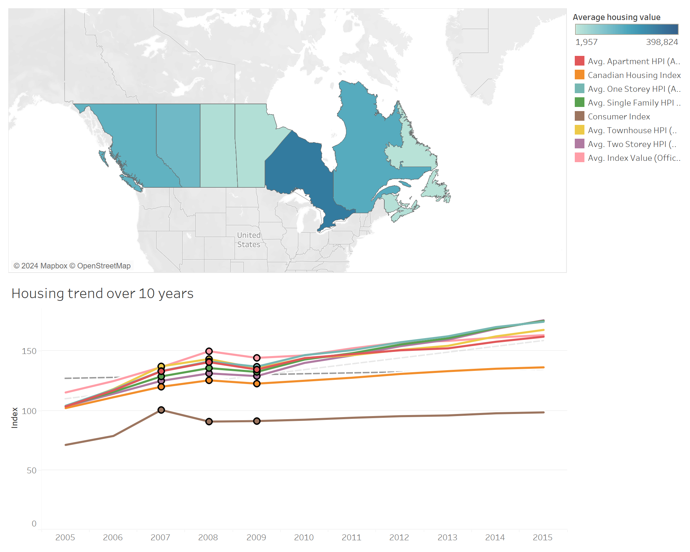

# Final-Project-Tableau

## Project/Goals
The goal of this project is to show visual trend of housing prices across Canada and the difference between those prices between different house or apartment units.

## Process
### For this project I choose Option 1 for the datasets and my first step was going over all the datasets that I was given as there were many different excel sheets.
### I created multiple treadlines of different housing categories with a consumer index and created a regression line between multiple values to see if there's any correlation between consumer index and housing price over 10 years.
### I also created a heatmap of average housing prices in all provinces in Canada. It looks like the average data was skewed by multiple values that were either 0 or close to that.
## Results
You can find the file for this projects dashboard [Here](/TableauProject.twbx)

We can observe that there is a correlation between consumer and housing index and how all plotlines were affected by 2008 housing market crash and the P-value of the regression line was close to 0 that indicates that these plotlines correlate with each other.

For the heatmap we can observe that Ontario housing prices on average were the highest and Newfoundland and Labrador were the lowest.
## Challenges and Future Goals
+ Multiple datasets with different measures of similar features
+ Add average household income data and categorize which income bracket is spending more of their share on housing.
+ Add USA consumer and housing data to the heatmap to expand the horizons.
